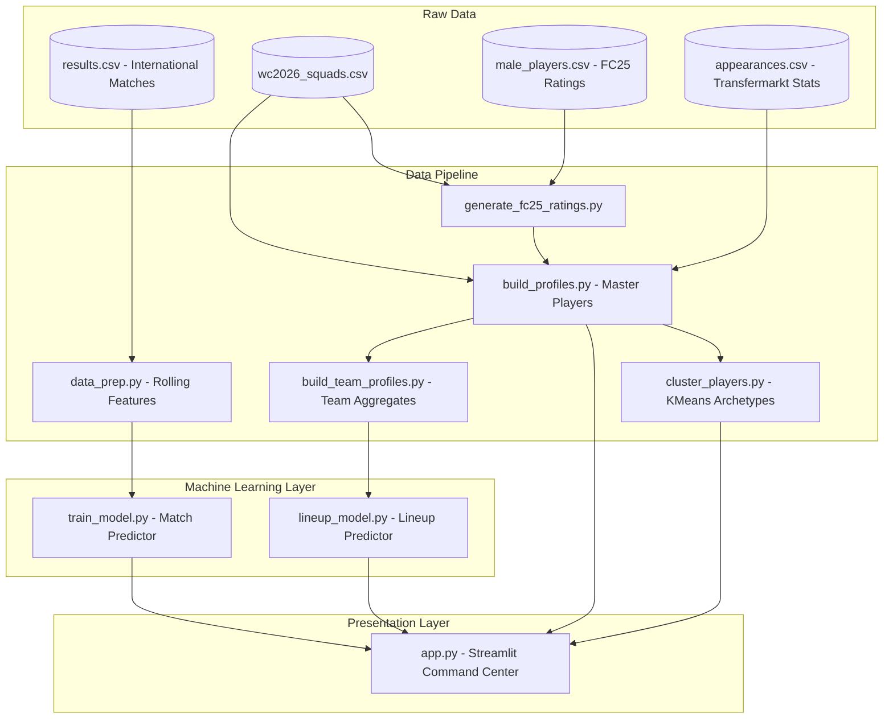

# ⚽ KickStats: FIFA World Cup 2026 Command Center

[](https://worldcup-predictor-athul.streamlit.app/)
[](https://www.python.org/)
[](https://streamlit.io/)
[](https://xgboost.readthedocs.io/)
[]()

**KickStats** is a state-of-the-art predictive analytics dashboard and simulator built for the **2026 FIFA World Cup**. Utilizing machine learning models trained on over a century of international football history combined with granular player data from **EA Sports FC 25** and **Transfermarkt**, KickStats delivers high-fidelity predictions, tactical lineup simulations, and visual talent scouting.

---

## 🛠️ System Architecture

The following diagram illustrates how raw datasets flow through the data preparation, profiling, and modeling layers to feed the Streamlit interactive dashboard:



---

## ⚡ Core Features

1. **Match Predictor (Historical ML):** Simulates head-to-head national matches using an optimized XGBoost classifier trained on recent 30-match rolling features, historical win rates, form, and goal difference.
2. **Lineup Predictor (Tactical Simulator):** Allows users to build starting lineups (1 GK + 10 outfield players) from actual World Cup squads and uses a lineup-aware XGBoost model to predict outcome probabilities and total goals.
3. **Player Scout (Transfermarkt & EA FC 25):** Provides customizable player profile cards detailing EA FC25 attributes (Pace, Passing, Defending, Dribbling, Shooting, Physicality) alongside career goals, assists, and market value.
4. **Cluster Analysis (Unsupervised Learning):** Uses K-Means clustering to partition squad players into four key player archetypes: *Clinical Striker*, *Playmaker*, *Workhorse*, and *Rotation Player*.
5. **Top Charts (Rankings):** Showcases data-driven dashboards of top-rated players, squad depths, valuations, and head-to-head match summaries.

---

## 🌐 Live Demo

> **Try it now — no installation required!**
> 
> 👉 **[https://worldcup-predictor-athul.streamlit.app/](https://worldcup-predictor-athul.streamlit.app/)**

---

## 🚀 Getting Started

### 1. Prerequisites
Ensure you have Python 3.10+ installed.

### 2. Installation
Clone this repository and install the dependencies:
```bash
# Clone the repository
git clone https://github.com/Athul-Titus/WorldCup_Predictor.git
cd worldcup-Project

# Activate virtual environment
venv\Scripts\activate

# Install requirements
pip install -r requirements.txt
```

### 3. Running the Pipeline
To rebuild all profiles, features, and train the machine learning models:
```bash
# Step 1: Synthesize and match squad ratings
python generate_fc25_ratings.py

# Step 2: Compile player and team profiles
python build_profiles.py
python build_team_profiles.py

# Step 3: Run K-Means player clustering
python cluster_players.py

# Step 4: Generate rolling features and train ML models
python data_prep.py
python train_model.py
python lineup_model.py
```

### 4. Launch the Dashboard
Start the local Streamlit development server:
```bash
streamlit run app.py
```

---

## 📊 Model Performance

*   **Match Predictor:** **55.0% accuracy** on historical test set (predicting Home Win / Draw / Away Win).
*   **Lineup Predictor:** **56.0% accuracy** on lineup-based outcome predictions.

*Note: In international football, class distribution is highly competitive, making ~55%+ accuracy statistically superior to standard baselines (~33% random, ~45% home-win bias).*
